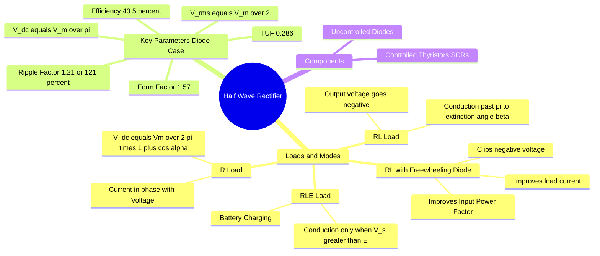

---
tags:
  - power-electronics
  - rectifiers
  - ac-dc-converter
  - gate
created: 2026-08-04T09:46:55
aliases:
  - Single-Phase Half-Wave Rectifier
  - 1-phi HWR
  - Controlled Half-Wave Rectifier
  - Biased Half-Wave Rectifier
  - Diode Circuit
subject: "[[Power Electronics]]"
parent:
  - Phase Controlled Rectifiers
modified: 2026-08-04T09:46:55
---
### Single-Phase Half-Wave Rectifier
#power-electronics/rectifiers #ac-dc

> A **Half-Wave Rectifier (HWR)** is the simplest type of <u>AC-to-DC converter</u>. It <u>allows current to flow to the load only during the positive half-cycle of the AC supply voltage, blocking the negative half-cycle</u>. While structurally simple, it has high ripple, poor efficiency, and low transformer utilization, making it primarily a conceptual stepping stone or suitable only for very low-power applications.

---
#### 1. R-Load (Resistive Load)
#rectifiers/r-load

Consider a controlled HWR using a Thyristor (SCR) with a firing angle $\alpha$. The supply voltage is $v_s = V_m \sin(\omega t)$.
*   **Conduction:** The SCR conducts from $\omega t = \alpha$ to $\omega t = \pi$.
*   **Average Output Voltage ($V_{dc}$ or $V_o$):**
    $$V_o = \frac{1}{2\pi} \int_{\alpha}^{\pi} V_m \sin(\omega t) d(\omega t)$$
    $$\boxed{\quad V_o = \frac{V_m}{2\pi} (1 + \cos\alpha) \quad}$$
*   **RMS Output Voltage ($V_{rms}$):**
    $$\boxed{\quad V_{rms} = \frac{V_m}{2} \sqrt{1 - \frac{\alpha}{\pi} + \frac{\sin 2\alpha}{2\pi}} \quad}$$
*   **Uncontrolled (Diode) Case:** Substitute $\alpha = 0$:
    *   $V_o = \frac{V_m}{\pi}$
    *   $V_{rms} = \frac{V_m}{2}$

---
#### 2. RL-Load (Resistive-Inductive Load)
#rectifiers/rl-load

Adding an inductor $L$ drastically changes the behavior due to the property of inductors resisting changes in current.
*   **Conduction Angle ($\gamma$):** Current continues to flow even after the supply voltage goes negative (past $\pi$) because the inductor releases its stored energy. The SCR stops conducting at the **Extinction Angle ($\beta$)**.
    *   Conduction angle $\gamma = \beta - \alpha$.
*   **Average Output Voltage:**
    $$V_o = \frac{1}{2\pi} \int_{\alpha}^{\beta} V_m \sin(\omega t) d(\omega t)$$
    $$\boxed{\quad V_o = \frac{V_m}{2\pi} (\cos\alpha - \cos\beta) \quad}$$
*   **Drawback:** The average output voltage is **reduced** because a negative voltage segment (from $\pi$ to $\beta$) appears across the load.

---
#### 3. RL-Load with Freewheeling Diode (FD)
#rectifiers/freewheeling-diode

To prevent the output voltage from becoming negative and to improve load current continuity, a **Freewheeling Diode (FD)** is connected in parallel with the RL load.
*   **Mechanism:** At $\omega t = \pi$, the supply voltage reverses. The FD becomes forward-biased and provides a low-impedance path for the inductor current. The SCR is commutated (turns off).
*   **Impact on Voltage:** The output voltage is clamped to zero during the freewheeling period. The negative area is clipped off.
*   **Average Output Voltage:** Restored to the R-load equation!
    $$\boxed{\quad V_o = \frac{V_m}{2\pi} (1 + \cos\alpha) \quad}$$
*   **Advantages of FD:**
    1.  Prevents negative output voltage.
    2.  Smoothes the load current (reduces current ripple).
    3.  Improves the Input Power Factor.

---
#### 4. RLE-Load (Battery Charging)
#rectifiers/rle-load

Used for charging batteries (DC source $E$) or driving DC motors with back-EMF ($E$).
*  <u>**Condition for Conduction:**</u> The SCR can only be fired if it is forward-biased, requiring $v_s > E$.
    *   Critical angle: $\theta_1 = \sin^{-1}\left(\frac{E}{V_m}\right)$.
    *   Extinction angle (for RLE, neglecting L): $\theta_2 = \pi - \theta_1$.
    *   Valid Firing Range: $\theta_1 \le \alpha \le \theta_2$.
*  <u>**Average Load Current ($I_o$):**</u>
    During conduction, $V_o = V_m \sin(\omega t)$.
    $$I_o = \frac{V_o - E}{R} = \frac{1}{2\pi R} \int_{\alpha}^{\theta_2} (V_m \sin(\omega t) - E) d(\omega t)$$

---
#### 5. Key Performance Parameters (GATE Focus)
#rectifiers/performance

For an **Uncontrolled (Diode)** Half-Wave Rectifier with Resistive Load:

1.  **Form Factor (FF):** A measure of the shape of the output voltage.
    $$FF = \frac{V_{rms}}{V_{dc}} = \frac{V_m/2}{V_m/\pi} = \frac{\pi}{2} \approx \boxed{1.57}$$
2.  **Ripple Factor (RF):** A measure of AC content in the DC output.
    $$RF = \sqrt{FF^2 - 1} = \sqrt{1.57^2 - 1} \approx \boxed{1.21 \text{ or } 121\%}$$
    *(High RF indicates poor DC quality).*
3.  **Rectification Efficiency ($\eta$):**
    $$\eta = \frac{P_{dc}}{P_{ac}} = \frac{V_{dc}^2 / R}{V_{rms}^2 / R} = \frac{4}{\pi^2} \approx \boxed{40.5\%}$$
    *(Maximum theoretical efficiency is only 40.5%).*
4.  **Transformer Utilization Factor (TUF):**
    $$TUF = \frac{P_{dc}}{\text{Transformer Secondary VA Rating}} \approx \boxed{0.286}$$
    *(Very poor. The transformer must be 1/0.286 = 3.5 times larger than the required DC power).*
5.  **Peak Inverse Voltage (PIV):** Maximum reverse voltage the diode/SCR must withstand.
    $$\boxed{\quad PIV = V_m \quad}$$

---
### Related Concepts
#topic/related-concepts

> [[Single-Phase Full-Wave Center-Tapped Controlled Rectifier|Single-Phase Full-Wave Controlled Rectifier (Center-Tapped, R or RL loads)]]

[[Phase-Controlled Rectifiers]]
[[Performance Parameters of Rectifiers]]
[[freewheeling diode]]
[[Power Factor of Rectifiers]]
[[SCR (Thyristor)]]
[[Fourier Series]] (Used to analyze harmonics in the HWR output)