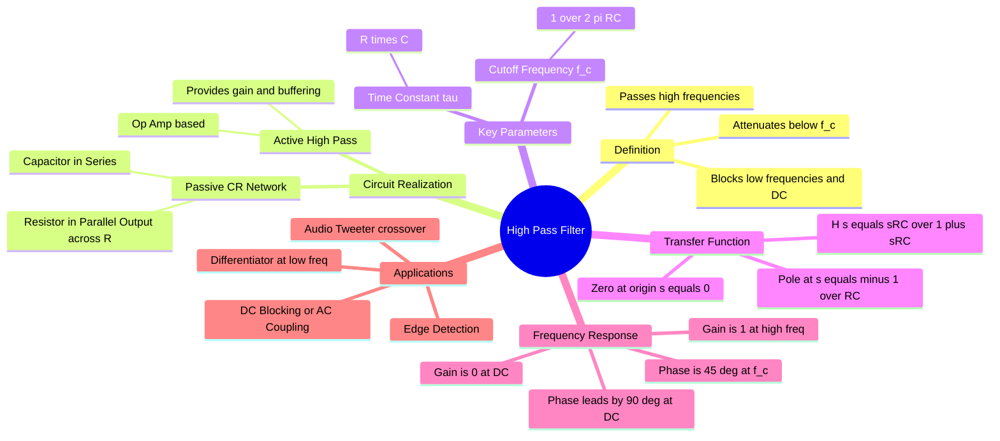

---
tags:
  - analog-electronics
  - signals-and-systems
  - filters
  - gate
  - circuit-theory
aliases:
  - HPF
  - High-Pass Filter
  - Differentiator Circuit
  - high-pass filter
  - high pass filter
created: 2026-08-04T09:47:19
subject: "[[Analog & Digital Electronics]]"
parent:
  - Filters (Active and Passive)
formula:
  - "Passive High-Pass Filter (Transfer Function): $$H(s) = \\frac{s\\tau}{1 + s\\tau}$$"
modified: 2026-08-04T09:47:19
---
### High-Pass Filter (HPF)
#filters #analog-electronics #circuit-theory

> A High-Pass Filter (HPF) is a frequency-selective circuit that allows signals with a frequency higher than a specific cutoff frequency ($\omega_c$) to pass through with little attenuation, while blocking or significantly attenuating signals with frequencies lower than the cutoff. Ideally, it completely blocks Direct Current (DC).

---
#### Passive RC High-Pass Filter (First Order)
#filters/passive-rc

![[Passive RC High-Pass Filter (First Order).png]]

The simplest passive implementation consists of a **Capacitor ($C$) in series** with the signal path and a **Resistor ($R$) in parallel** with the load (output taken across the resistor).

##### Transfer Function Derivation (Voltage Divider)
The impedance of the capacitor is $Z_C = \frac{1}{sC}$ and the resistor is $Z_R = R$.
$$H(s) = \frac{V_{out}(s)}{V_{in}(s)} = \frac{R}{R + \frac{1}{sC}} = \frac{sRC}{1 + sRC}$$

Let the time constant be $\tau = RC$.
$$\boxed{\quad H(s) = \frac{s\tau}{1 + s\tau} \quad}$$

> [!pyq]- PYQ : 2019
> ![[ee_2019#^q6]]

##### Pole-Zero Plot
*   **Zero:** At the origin ($s=0$). This causes the DC gain to be zero.
*   **Pole:** At $s = -\frac{1}{\tau} = -\frac{1}{RC}$.

#### Frequency Response Characteristics
#filters/frequency-response

Substituting $s = j\omega$ to analyze the steady-state response to sinusoidal inputs:
$$H(j\omega) = \frac{j\omega RC}{1 + j\omega RC} = \frac{j(\omega/\omega_c)}{1 + j(\omega/\omega_c)}$$

##### Cutoff Frequency ($\omega_c$)
The frequency where the magnitude drops to $1/\sqrt{2}$ (-3 dB) of the maximum passband gain.
$$\boxed{\quad \omega_c = \frac{1}{RC} \quad \text{rad/s} \quad}$$
$$\boxed{\quad f_c = \frac{1}{2\pi RC} \quad \text{Hz} \quad}$$

##### Magnitude Response
$$\boxed{\quad |H(j\omega)| = \frac{\omega RC}{\sqrt{1 + (\omega RC)^2}} \quad}$$
*   **At DC ($\omega = 0$):** $|H(j\omega)| = 0$ (Blocks DC).
*   **At Cutoff ($\omega = \omega_c$):** $|H(j\omega)| = \frac{1}{\sqrt{2}} \approx 0.707$.
*   **At High Freq ($\omega \to \infty$):** $|H(j\omega)| \approx 1$ (Passes signal).

##### Phase Response
$$\boxed{\quad \phi(\omega) = \angle H(j\omega) = 90^\circ - \tan^{-1}(\omega RC) \quad}$$
*   **At DC:** Phase is $+90^\circ$ (Output leads Input).
*   **At Cutoff:** Phase is $+45^\circ$.
*   **At High Freq:** Phase approaches $0^\circ$.

##### Sinusoidal Output
If $v_{in}(t) = V_m \sin(\omega t)$, then:
$$v_{out}(t) = V_m |H(j\omega)| \sin(\omega t + \phi(\omega))$$

#### HPF as a Differentiator
#filters/differentiator

When the input frequency is very low compared to the cutoff frequency ($\omega \ll \omega_c$), the denominator of the transfer function approximates to 1:
$$H(j\omega) \approx j\omega RC$$
In the time domain, multiplication by $j\omega$ (or $s$) corresponds to differentiation.
$$\boxed{\quad v_{out}(t) \approx RC \frac{d v_{in}(t)}{dt} \quad}$$
Thus, a passive HPF acts as a **Differentiator** for low-frequency inputs (or when the time constant $\tau$ is very small compared to the signal period). It produces spikes at the edges of a square wave input.

#### Active High-Pass Filter
#filters/active

To avoid loading effects and provide gain, an Op-Amp is used.
##### Non-Inverting Active HPF
*   Input is applied to the non-inverting terminal through a CR network.
*   Gain $A_F = 1 + \frac{R_f}{R_1}$.
*   Transfer Function:
    $$H(s) = \left( 1 + \frac{R_f}{R_1} \right) \frac{sRC}{1 + sRC}$$

#### Applications
#filters/applications

1. **DC Blocking / AC Coupling:** Removing the DC offset component from a signal (e.g., connecting amplifier stages).
2. **Audio Systems:** "Tweeter" crossover networks to direct high frequencies to the tweeter speakers.
3. **Image Processing:** Sharpening images by emphasizing high-frequency transitions (edges).
4. **Noise Removal:** Filtering out low-frequency rumble or mains hum (50/60 Hz) if the signal of interest is high frequency.

---
### Related Concepts
#topic/related-concepts

> [[Low-Pass Filter]] (The dual of HPF)

[[Bandpass Filter]] (HPF + LPF in cascade)
[[Integrator and Differentiator Circuits]]
[[Bode Plots]]
[[Operational Amplifiers]]
[[RC Circuit Transient Analysis]] (Response to Step Input)
[[The Laplace Transform]]
