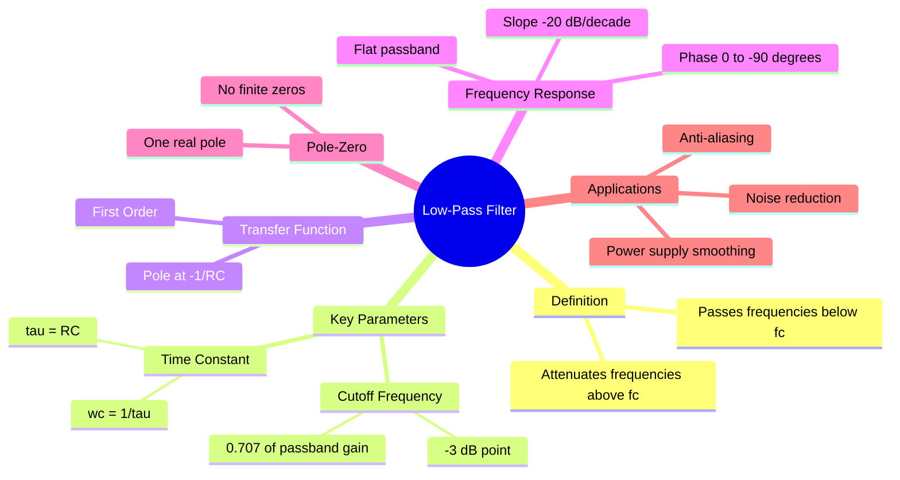

---
tags:
  - analog-electronics
  - signals-and-systems
  - filters
  - gate
  - circuit-theory
created: 2026-08-04T09:56:52
aliases:
  - LPF
  - Low Pass Filter
  - Integrator Circuit
  - low-pass filter
  - low pass filter
subject: "[[Analog & Digital Electronics]]"
parent:
  - Filters (Active and Passive)
formula:
  - "Passive Low-Pass Filter (Transfer Function): $$H(s) = \\frac{1}{1 + s\\tau}$$"
modified: 2026-08-04T09:56:52
---
### Low-Pass Filter (LPF)
#filters #analog-electronics #circuit-theory

> A Low-Pass Filter (LPF) is a circuit that allows signals with a frequency lower than a certain cutoff frequency to pass through while attenuating frequencies higher than the cutoff frequency. Ideally, it blocks all high frequencies, but in practice, the transition is gradual.

---
#### Passive RC Low-Pass Filter (First Order)
#filters/passive-rc

![[Passive RC Low-Pass Filter (First Order).png]]

The simplest implementation consists of a Resistor ($R$) in series with the signal path and a Capacitor ($C$) in parallel with the load (output taken across the capacitor).

##### Transfer Function Derivation (Voltage Divider)
Using Laplace transform impedances ($Z_R = R$, $Z_C = 1/sC$):
$$H(s) = \frac{V_{out}(s)}{V_{in}(s)} = \frac{1/sC}{R + 1/sC} = \frac{1}{1 + sRC}$$

Let the time constant be $\tau = RC$.
$$\boxed{\quad H(s) = \frac{1}{1 + s\tau} \quad}$$

> [!pyq]- PYQ : 2019
> ![[ee_2019#^q6]]

---
##### Pole Location
The system has a single pole at $s = -\frac{1}{\tau} = -\frac{1}{RC}$. Since the pole is in the Left Half Plane (LHP), the system is stable.

---
#### Frequency Characteristics
#filters/frequency-response

Substituting $s = j\omega$:
$$H(j\omega) = \frac{1}{1 + j\omega RC} = \frac{1}{1 + j(\omega/\omega_c)}$$

##### Cutoff Frequency
The frequency at which the gain drops to $1/\sqrt{2}$ (or -3dB) of its DC value.
$$\boxed{\quad \omega_c = \frac{1}{\tau} = \frac{1}{RC} \quad \text{rad/s} \quad}$$
$$\boxed{\quad f_c = \frac{1}{2\pi RC} \quad \text{Hz} \quad}$$

---
##### Magnitude Response
$$|H(j\omega)| = \frac{1}{\sqrt{1 + (\omega RC)^2}} = \frac{1}{\sqrt{1 + (\omega/\omega_c)^2}}$$
* At $\omega = 0$ (DC): Gain = 1 (0 dB).
* At $\omega = \omega_c$: Gain = $1/\sqrt{2} \approx 0.707$ (-3 dB).
* At $\omega \gg \omega_c$: Gain $\propto 1/\omega$ (Roll-off rate of -20 dB/decade).

---
##### Phase Response
$$\boxed{\quad \phi(\omega) = -\tan^{-1}(\omega RC) \quad}$$
* Range: $0^\circ$ at DC to $-90^\circ$ at $\infty$.
* At $\omega_c$, phase is $-45^\circ$.

---
#### LPF as an Integrator
#filters/integrator

When the frequency of the input signal is very high compared to the cutoff frequency ($\omega \gg \omega_c$), the transfer function approximates:
$$H(j\omega) \approx \frac{1}{j\omega RC}$$
In the time domain, division by $j\omega$ corresponds to integration.
$$\boxed{\quad v_{out}(t) \approx \frac{1}{RC} \int v_{in}(t) dt \quad}$$
Thus, a passive LPF acts as an **Integrator** for high-frequency inputs (or when time constant $\tau$ is very large compared to the input signal period).

---
#### Active Low-Pass Filter
#filters/active

Passive filters suffer from loading effects (output impedance is not zero). Active filters use Operational Amplifiers (Op-Amps) to provide buffering (high input impedance, low output impedance) and potential gain.
##### First-Order Active LPF (Non-Inverting)
* Consists of an RC filter at the non-inverting terminal of an Op-Amp.
* Transfer Function:
    $$H(s) = \left( 1 + \frac{R_f}{R_1} \right) \frac{1}{1 + sRC}$$
    Where $(1 + R_f/R_1)$ is the passband gain $A_0$.

---
#### Applications
#applications #low-pass-filter/applications 

* **Anti-Aliasing Filter**: Placed before an ADC to remove frequencies above the Nyquist rate.
* **Power Supply Filtering**: Removing AC ripple from DC voltage (e.g., capacitor filter in rectifiers).
* **Audio Systems**: Removing high-frequency noise (hiss) or driving subwoofers (crossovers).
* **Demodulation**: Retrieving the message signal from AM/FM/PWM signals.

---
### Related Concepts
#topic/related-concepts

> [[High-Pass Filter]] (The dual of LPF)
> [[Bandpass Filter]] (Combination of LPF and HPF)

[[Bode Plots]]
[[Operational Amplifiers]]
[[RC Circuit Transient Analysis]]
[[Integrator and Differentiator Circuits]]
[[The Sampling Theorem (Nyquist-Shannon Theorem)]] (Context for Anti-aliasing)
