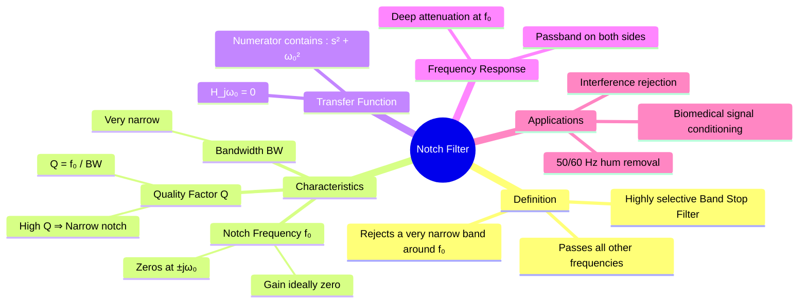

---
tags:
  - analog-electronics
  - signals-and-systems
  - filters
  - gate
  - circuit-theory
created: 2026-08-04T10:08:09
aliases:
  - Band-Reject Filter
  - Band-Stop Filter
  - Twin-T Filter
subject: "[[Analog & Digital Electronics]]"
parent:
  - Filters (Active and Passive)
formula:
  - "Notch Filter (Transfer Function) : $$H(s) = \\frac{V_{out}(s)}{V_{in}(s)} = K \\frac{s^2 + \\omega_0^2}{s^2 + \\frac{\\omega_0}{Q}s + \\omega_0^2}$$"
modified: 2026-08-04T10:08:09
---
### Notch Filter (Band-Stop Filter)
#filters #analog-electronics #signal-processing

> A **Notch Filter** is a specialized Band-Stop Filter (BSF) characterized by a very narrow stopband (high Quality Factor, $Q$). It is designed to attenuate or "notch out" a specific single frequency ($\omega_0$) while allowing all other frequencies to pass with unity gain.

---
#### Ideal Characteristics
#filters/characteristics

*   **Passband:** Frequencies $0$ to $\omega_L$ and $\omega_H$ to $\infty$.
*   **Stopband:** A very narrow range centered at $\omega_0$.
*   **Notch Frequency ($\omega_0$):** The frequency where transmission is zero (Infinite attenuation).
*   **Relationship:**
    $$\omega_0 = \sqrt{\omega_L \omega_H}$$
    $$BW = \omega_H - \omega_L = \frac{\omega_0}{Q}$$

---
#### Transfer Function (s-Domain)
#filters/transfer-function

The standard second-order transfer function for a notch filter is derived by ensuring **zeros on the $j\omega$ axis**.

$$\boxed{\quad H(s) = \frac{V_{out}(s)}{V_{in}(s)} = K \frac{s^2 + \omega_0^2}{s^2 + \frac{\omega_0}{Q}s + \omega_0^2} \quad}$$

*   **Zeros:** Occur at $s^2 + \omega_0^2 = 0 \implies s = \pm j\omega_0$.
*   **Poles:** Occur in the Left Half Plane (for stability).

**Frequency Response ($s = j\omega$):**
$$H(j\omega) = K \frac{\omega_0^2 - \omega^2}{(\omega_0^2 - \omega^2) + j \frac{\omega_0 \omega}{Q}}$$

*   **At $\omega = 0$ (DC):** $H(0) = K$ (Pass).
*   **At $\omega = \omega_0$ (Notch):** $Numerator = 0 \implies H(j\omega_0) = 0$ (Complete Rejection).
*   **At $\omega \to \infty$:** $H(\infty) = K$ (Pass).

> [!pyq]- PYQ : 2019
> ![[ee_2019#^q6]]

---
#### Circuit Realization: The Twin-T Network
#filters/twin-t

The most common passive implementation for a notch filter is the **Twin-T Network**. It consists of two T-networks connected in parallel:
1.  **Low-Pass T:** Two resistors ($R$) in series, one capacitor ($2C$) to ground.
2.  **High-Pass T:** Two capacitors ($C$) in series, one resistor ($R/2$) to ground.

**Condition for Null (Notch):**
For a deep null at $f_0$, the components must be matched such that:
$$R_1 = R_2 = R, \quad R_3 = R/2$$
$$C_1 = C_2 = C, \quad C_3 = 2C$$

**Notch Frequency:**
$$\boxed{\quad f_0 = \frac{1}{2\pi R C} \quad}$$

*   **Disadvantage of Passive Twin-T:** The Quality Factor ($Q$) is fixed at **$0.25$**, which is very low (wide bandwidth). To create a sharp notch (High Q), **Active Bootstrapping** (using an Op-Amp) is required to feed output voltage back into the network ground reference.

---
#### Active Notch Filter (Op-Amp)
To achieve a narrow bandwidth (High Q), the Twin-T network is usually placed in the feedback loop of an Op-Amp, or used with a voltage follower.

Alternatively, a **State Variable Filter** or **Biquad** topology can be used to realize the transfer function:
$$H(s) = V_{in} - V_{BandPass}$$
Subtracting the bandpass output from the input leaves only the high and low frequencies (Notch).

---
#### RLC Realization
A simple passive notch filter can be made using an inductor and capacitor.

**Series LC Shunt:**
Place an Inductor ($L$) and Capacitor ($C$) in series with each other, and place this combination **in parallel with the load**.
*   At resonance $\omega_0 = 1/\sqrt{LC}$, the series impedance of L and C is **zero** (short circuit).
*   The signal is shorted to ground, $V_{out} = 0$.

---
#### Applications
#filters/applications

1.  **Mains Hum Rejection:** Removing 50 Hz (or 60 Hz) power line interference from sensitive medical equipment (like ECG/EEG monitors) or audio systems.
2.  **Communications:** Eliminating specific interference frequencies or pilot tones from a broadcast signal.
3.  **Instrumentation:** Removing mechanical resonance frequencies from sensor data.

---
### Related Concepts
#topic/related-concepts

> [[Bandpass Filter]] (Inverse operation)

[[Low Pass Filter]]
[[High Pass Filter]]
[[Resonance in Series RLC Circuit]]
[[Operational Amplifiers]]
[[Bode Plots]] (Visualizing the V-shape magnitude response)
[[Quality Factor (Q)]] (Determines the sharpness of the notch)
