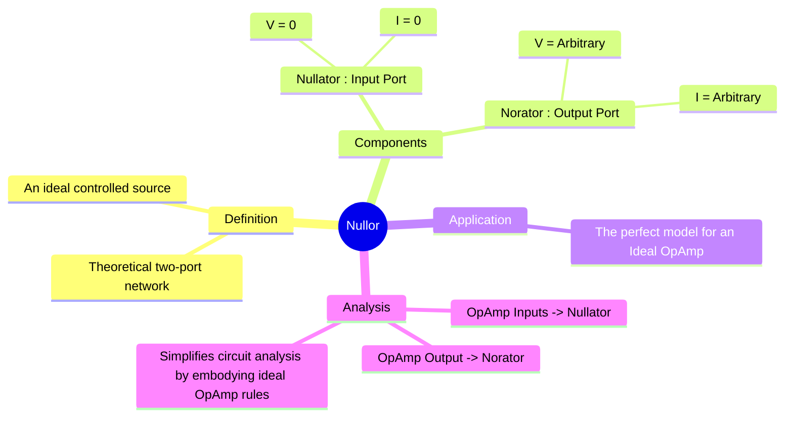

---
tags:
  - nullor
  - nullator
  - norator
  - ideal-op-amp
  - two-port-network
  - analog-electronics
created: 2025-09-08
aliases:
  - Ideal Op-Amp Model
  - Nullator-Norator
subject: "[[Analog & Digital Electronics]]"
parent:
  - Operational Amplifiers (Op-Amps)
modified: 2026-08-04T10:08:38
---
### Nullor
#nullor #ideal-circuit-element

> A **nullor** is a theoretical [[Two-Port Networks|two-port network]] that serves as the ultimate model for an [[Ideal Op-Amp]]. It is a combination of two pathological (idealized) one-port elements: a **nullator** at the input port and a **norator** at the output port. The nullor concept simplifies the analysis of circuits containing ideal op-amps by perfectly representing their behavior.

---
#### Nullor Components

##### 1. The Nullator (Input Port)
#nullator

A nullator is a one-port element with the defining characteristic that the voltage across it and the current through it are simultaneously zero, regardless of the external circuit.
$$\boxed{\quad V = 0 \quad \text{and} \quad I = 0 \quad}$$
*   **$V=0$**: It acts as a short circuit in terms of voltage.
*   **$I=0$**: It acts as an open circuit in terms of current.
Physically, it acts as a perfect sensor that can sense a voltage difference (and enforce it to be zero) without drawing any current.

> See [[ee_2025#^q19]]

##### 2. The Norator (Output Port)
#norator

A norator is a one-port element where the voltage across it and the current through it can be completely arbitrary.
$$\boxed{\quad V = \text{Arbitrary} \quad \text{and} \quad I = \text{Arbitrary} \quad}$$
The values of V and I for a norator are determined solely by the external circuit it is connected to. It acts as an ideal controlled source that can provide any voltage or current required to satisfy the conditions imposed by the rest of the circuit.

---
#### The Nullor as an Ideal Op-Amp Model
#ideal-op-amp-model

The most important application of the nullor is as an equivalent circuit for an ideal operational amplifier.
* The **nullator** is placed between the non-inverting ($V_+$) and inverting ($V_-$) input terminals of the op-amp.
* The **norator** is placed between the op-amp's output terminal and ground.

This model perfectly captures the two golden rules of an ideal op-amp in negative feedback:
1. **Nullator Property ($V=0$)**: The voltage across the nullator is zero, meaning $V_+ - V_- = 0$, or $V_+ = V_-$. This is the **[[Virtual Short Circuit]]** principle.
2. **Nullator Property ($I=0$)**: The current flowing into the nullator is zero. This corresponds to the op-amp's **infinite input impedance**, meaning no current flows into the inverting or non-inverting terminals.
3. **Norator Property (Arbitrary V and I)**: The norator at the output can provide whatever voltage ($V_{out}$) and current ($I_{out}$) are necessary to maintain the nullator's conditions (the virtual short). This represents the op-amp's **zero output impedance** and infinite gain.

Using the nullor model, any circuit with an ideal op-amp can be analyzed simply by applying standard KCL and KVL, with the nullator and norator enforcing the constraints.

---
### Related Concepts
#related-concepts

> [[Operational Amplifiers]] (The device that the nullor models)

[[Ideal Op-Amp]]
[[Virtual Short Circuit]] (A direct consequence of the nullator model)
[[Two-Port Networks]] (The category of circuit elements the nullor belongs to)
[[Circuit Analysis Techniques]]